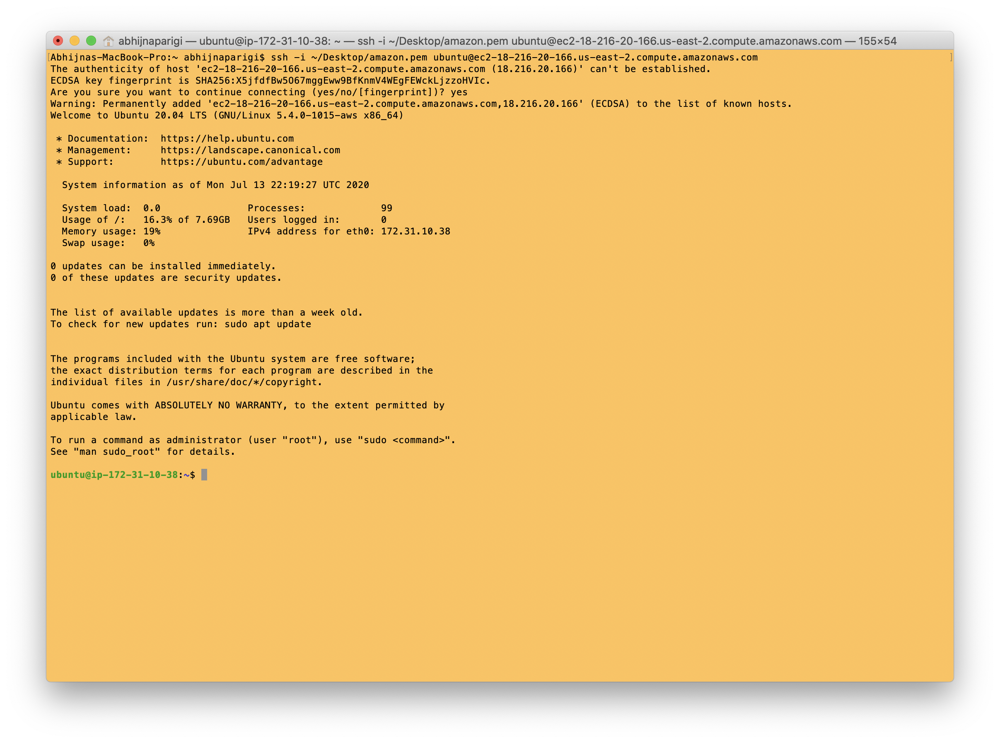

Download and move data to AWS
==============================

!!! Important
    The coat color data lives in a website called Cyverse. It is not easy to make AWS talk to cyverse, so download the data onto your LOCAL computer and then upload it to AWS.

## Download data to local computer

* Open up a terminal window by searching (type cmd+space_bar) for "terminal" on your Mac.

* Make a folder called GWAS on your Desktop and then navigate to the folder by typing the following commands in your terminal:

```
mkdir ~/Desktop/GWAS
cd ~/Desktop/GWAS
```
* You will use a free software called [wget](https://en.wikipedia.org/wiki/Wget) to retrieve data files of interest from Cyverse. First install wget like so:

```
/usr/bin/ruby -e "$(curl -fsSL https://raw.githubusercontent.com/Homebrew/install/master/install)"
brew install wget
```

* Now run these commands to do the actual downloading:

```
wget https://de.cyverse.org/dl/d/E0A502CC-F806-4857-9C3A-BAEAA0CCC694/pruned_coatColor_maf_geno.vcf.gz
wget https://de.cyverse.org/dl/d/3B5C1853-C092-488C-8C2F-CE6E8526E96B/coatColor.pheno
```
The first command downloads the vcf file and the second command downloads the file that specifies phenotype information. The download may take a few seconds.

* Check if your data download worked by typing `ls`. This command lists all the files in your current (GWAS) directory. Output should be:

```
coatColor.pheno				pruned_coatColor_maf_geno.vcf.gz
```


## Getting to the AWS instance

OK, so you've created a [running computer on the cloud](aws_instance_setup.md). How do you get to it? We will use the Mac terminal window to access the cloud computer.

To access the cloud computer, you need the network name of our new computer. This can be found at the bottom of the [instance log page](https://us-east-2.console.aws.amazon.com/ec2/v2/home?region=us-east-2#Instances:sort=instanceId) shown here:


Copy this name, connect to the cloud computer with ssh under the username ‘ubuntu’, as follows:

* Find the private key file; it’s the `.pem` file you downloaded when starting up the EC2 instance. If you saved it in the default location, it should be in the "Downloads" folder. Remember, you named it `amazon.pem`.

* Move amazon.pem to your `~Desktop/GWAS` folder with copy+paste. Remember to delete the amazon.pem from the Downloads folder to prevent clutter. Check the contents of your `~Desktop/GWAS` folder again with `ls`. Do you see the `amazon.pem`?

* Now run this command to set the permissions on the amazon.pem private key file to “closed to all evildoers”.

```
chmod og-rwx ~/Desktop/GWAS/amazon.pem
```

* Finally, log in to the cloud computer:

```
ssh -i ~/Desktop/GWAS/amazon.pem ubuntu@ec2-???-???-???-???.compute-1.amazonaws.com
```

!!! Important
    Replace the stuff after the ‘@’ sign with the name of the host; see the red circle on your own instance:
    

    If you have trouble with this command, here's another way to do it:

    * Visit the [aws instances webpage](https://us-east-2.console.aws.amazon.com/ec2/v2/home?region=us-east-2#Instances:sort=instanceId)

    * Select your instance and then click the "Connect" button next to "Launch Instance".

    * You will see a pop-up window that gives you the correct connect command under "Example".

    * Copy and paste the command into your terminal window.

!!! Tip
    You will see this message when running the ssh command for the first time:

    The authenticity of host 'ecc2-???-???-???-???.compute-1.amazonaws.com (3.129.57.169)' can't be established.
    ECDSA key fingerprint is XXX.
    Are you sure you want to continue connecting (yes/no/[fingerprint])? **yes**

    Type "yes" and press enter.


* If everything works ok, you should see something like this:



!!! Note
    My terminal window is yellow, but yours may not be!

* You have now successfully logged in as user ‘ubuntu’ to the machine ‘ec2-18-216-20-166.us-east-2.compute.amazonaws.com’ using the authentication key located in ‘amazon.pem’ on the Desktop.

* This is your remote/cloud Ubuntu computer. Look at what's in this computer by typing `ls`. If nothing happens, it means there are no folder or files to list!

* Make a folder called "GWAS" in the Ubuntu computer by typing:

```
mkdir GWAS
```
Check if you have this directory with `ls`.


## Upload data to AWS

* To upload data from your local computer to AWS, you must first logout of AWS. Type:

```
logout
```

* Now you are back in your local Mac terminal. You can upload files to AWS by typing this command:

```
scp -i ~/Desktop/GWAS/amazon.pem ~/Desktop/GWAS/pruned_coatColor_maf_geno.vcf.gz ubuntu@ec2-???-???-???-???.compute-1.amazonaws.com:~/GWAS/
scp -i ~/Desktop/GWAS/amazon.pem ~/Desktop/GWAS/coatColor.pheno ubuntu@ec2-???-???-???-???.compute-1.amazonaws.com:~/GWAS/
```
Here `scp` is short for secure copy. You're copying files from the GWAS folder on your local machine to the GWAS folder in the remote Ubuntu computer. Be sure to change the ec2 instance name like you did earlier.

* To check if this worked, log back into the remote Ubuntu instance by **typing in the ssh command described above**. Then change directory to the GWAS and list files in it:

```
cd GWAS
ls
```
Do you see the files?

* Finally, unzip the `pruned_coatColor_maf_geno.vcf.gz` file using gunzip.

```
gunzip pruned_coatColor_maf_geno.vcf.gz
```
This command should remove the `.gz` from the file name.
